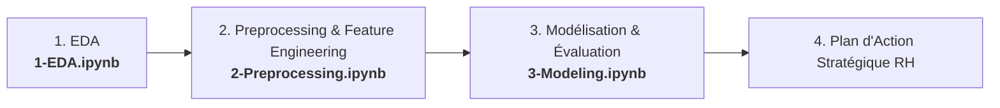
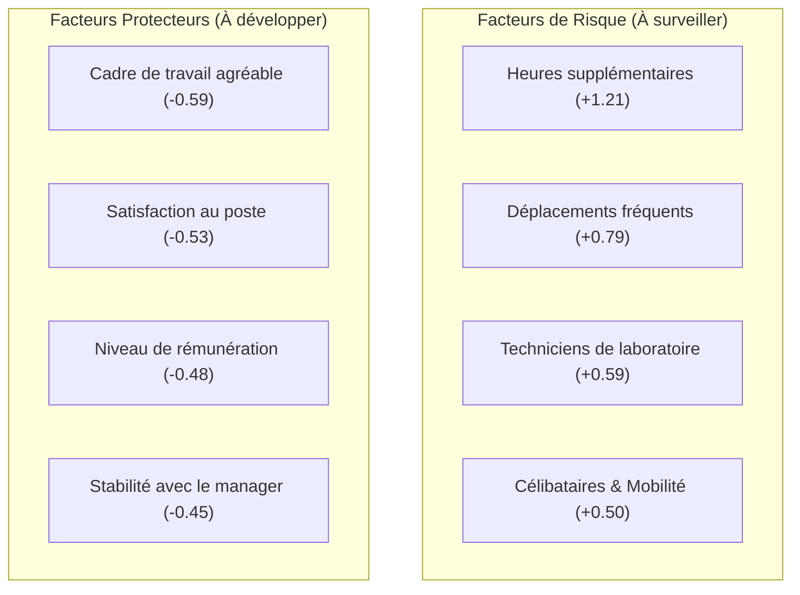

# 📊 Prédiction de l'Attrition des Employés & Rétention des Talents (HR Analytics)

Ce projet propose une démarche complète de Data Science appliquée aux Ressources Humaines : de l'exploration analytique des données (*EDA*) à la modélisation prédictive du risque de départ (*Employee Attrition*), jusqu'à la formulation de recommandations stratégiques pour la direction des ressources humaines.

---

## 1. Contexte

Le turnover non anticipé représente un coût considérable pour les organisations : dépenses de recrutement, temps d'intégration, perte de savoir-faire technique et impact négatif sur le moral des équipes.  
Dans un marché du travail compétitif, anticiper les départs volontaires permet aux équipes RH de passer d'une gestion réactive (remplacer dans l'urgence un collaborateur démissionnaire) à une politique proactive de fidélisation ciblée.

Ce projet s'appuie sur le jeu de données d'entreprise **IBM HR Analytics Employee Attrition & Performance**.

---

## 2. Objectifs

Le projet répond à une double ambition :
1. **Objectif Diagnostique & Explicatif :** Identifier les leviers organisationnels, managériaux et financiers associés au départ des collaborateurs afin de comprendre les causes profondes du turnover.
2. **Objectif Prédictif & Décisionnel :** Développer un modèle de Machine Learning capable de repérer précocement les profils à risque d'attrition, tout en garantissant un niveau élevé de transparence et d'équité éthique (*fairness*).

---

## 3. Dataset

Le jeu de données comprend **1 470 observations (employés) et 35 variables d'origine**, sans **aucune valeur manquante (`0 NaN`)**.

### Variable cible
- **`Attrition`** : variable binaire indiquant si le collaborateur a quitté l'organisation (`Yes`) ou est resté (`No`).

### Typologie métier des variables
Les variables ont été catégorisées selon leur signification métier réelle :
- **Informations personnelles & démographiques :** `Age`, `Gender`, `MaritalStatus`, `Education`, `EducationField`, `DistanceFromHome`.
- **Satisfaction et bien-être au travail (ordinales 1 à 4) :** `EnvironmentSatisfaction`, `JobSatisfaction`, `JobInvolvement`, `RelationshipSatisfaction`, `WorkLifeBalance`.
- **Organisation & Carrière :** `Department`, `JobRole`, `JobLevel` (1 à 5), `BusinessTravel`, `OverTime`.
- **Rémunération & Ancienneté :** `MonthlyIncome`, `PercentSalaryHike`, `StockOptionLevel` (0 à 3), `TotalWorkingYears`, `YearsAtCompany`, `YearsInCurrentRole`, `YearsSinceLastPromotion`, `YearsWithCurrManager`.
- **Variables administratives / constantes :** `EmployeeNumber`, `EmployeeCount`, `StandardHours`, `Over18`.

---

## 4. Méthodologie

Le projet est structuré en **3 étapes séquentielles et étanches** (pour prévenir tout phénomène de *Data Leakage*) :



1. **Analyse Exploratoire (`1-EDA.ipynb`) :** Étude univariée, bivariée et multivariée avec identification du déséquilibre de classe et des corrélations fortes.
2. **Prétraitement & Feature Engineering (`2-Preprocessing.ipynb`) :**
   - **Sélection argumentée :** Exclusion des 4 constantes/identifiants, de `Gender` (principe éthique de fairness), des taux financiers uniformes sans signal (`DailyRate`, `HourlyRate`, `MonthlyRate`), et de `JobLevel` / `PerformanceRating` (redondances colinéaires).
   - **Feature Engineering :** Création de ratios de trajectoire interne (`YearsWithCurrManager_Ratio`, `YearsSinceLastPromotion_Ratio`, `CompanyTenure_Ratio`) et transformation $\log(1+x)$ du revenu mensuel pour corriger l'asymétrie.
   - **Découpage Train/Test stratifié (80/20) :** Séparation étanche avant tout apprentissage.
   - **Pipeline `ColumnTransformer` :** Encodage *One-Hot* (`drop='first'`) des nominales et mise à l'échelle par `RobustScaler` (résistant aux outliers).
   - **Gestion du déséquilibre :** Calcul des poids de classes (*Class Weights*) et génération d'un jeu rééquilibré par *SMOTE*.
3. **Modélisation & Optimisation (`3-Modeling.ipynb`) :**
   - Établissement d'une baseline et démonstration de la nécessité de compenser le déséquilibre.
   - Benchmark comparatif sous validation croisée stratifiée à 5 blocs (*Stratified 5-Fold CV*).
   - Optimisation par grille (*GridSearchCV*) et analyse de sensibilité du seuil de décision.
   - Interprétation des coefficients et extraction des facteurs d'influence.

---

## 5. Résultats Clés de l'EDA

L'analyse exploratoire a mis en lumière des enseignements structurels déterminants :

* **Un déséquilibre de classe prononcé :** Seuls **16.1%** des collaborateurs ont démissionné (237 départs vs 1 233 maintiens).
* **L'overtime comme accélérateur critique :** Le taux d'attrition atteint **30.5%** chez les salariés faisant des heures supplémentaires régulières, contre seulement **10.4%** chez ceux qui n'en font pas (facteur multiplicateur de 3).
* **Des disparités sectorielles et hiérarchiques marquées :**
  - Les postes de terrain (*Sales Representatives* à **39.8%**, *Laboratory Technicians* à **23.9%**) et les postes de niveau d'entrée (`JobLevel = 1` à **26.3%**) connaissent le plus fort turnover.
  - À l'inverse, les cadres dirigeants (*Managers* à **4.9%**, *Research Directors* à **2.5%**) bénéficient d'une stabilité quasi totale.
* **Le rôle amortisseur du salaire :** Le salaire médian des démissionnaires est de **3 202 $**, contre **5 204 $** pour les salariés stables (écart médian de près de 2 000 $).
* **Nuance relationnelle :** Pour `RelationshipSatisfaction`, le sur-risque intervient uniquement en cas de relations dégradées (note 1 à **20.7%** de départs) ; au-delà (notes 2 à 4), le taux se stabilise autour de 15%.
* **Multicolinéarité :** Corrélation quasi parfaite entre `JobLevel` et `MonthlyIncome` (**0.95**) et fortes corrélations internes du bloc d'ancienneté (> **0.75**).

---

## 6. Modèle Retenu

Après comparaison sous validation croisée 5-Fold de trois familles d'algorithmes (Régression Logistique, Random Forest, HistGradientBoosting), le modèle sélectionné est :

### 🏆 Régression Logistique Régularisée ($C = 0.1$, pénalité $L_2$) avec Pondération (`class_weight='balanced'`)

**Pourquoi ce choix ?**
1. **Sensibilité supérieure :** Il maximise la détection des départs réels (Recall de **73.2%** en validation croisée).
2. **Régularité et robustesse :** Faible variance entre les blocs de validation croisée ($\text{ROC-AUC} = 0.839 \pm 0.021$).
3. **Explicabilité totale :** Contrairement aux modèles ensemblistes opaques, chaque coefficient $\beta$ correspond directement à l'impact relatif d'une variable sur la cote de départ (*Log-Odds*).

---

## 7. Métriques & Performances

### Justification du rejet de l'Accuracy
Dans un contexte où 84% des salariés restent, un modèle prédisant systématiquement `No` obtiendrait 83.9% d'accuracy sans détecter aucun départ. Nous privilégions :
- **Recall (Rappel) :** Pourcentage de vrais départs détectés par le modèle.
- **F1-Score :** Compromis harmonique entre Précision et Rappel.
- **ROC-AUC & PR-AUC :** Capacité globale de discrimination probabiliste.

### Performances sur le Test Set indépendant (294 employés, 47 départs réels)

| Métrique | Score obtenu | Interprétation opérationnelle |
| :--- | :---: | :--- |
| **Recall (Rappel)** | **68.1%** | **32 départs détectés sur 47** (le taux de détection a été doublé par rapport au modèle standard non pondéré à 34%). |
| **ROC-AUC** | **0.815** | Très bonne séparation globale des distributions de probabilité. |
| **Precision** | **38.6%** | Environ 4 alertes sur 10 correspondent à un départ réel avéré. |
| **F1-Score** | **0.492** | Équilibre optimisé pour un cas d'usage RH orienté détection. |

---

## 8. Recommandations Stratégiques RH

L'analyse des coefficients du modèle final met en évidence les leviers d'action concrets pour la direction générale :



### Plan d'action prioritaire :
1. **Réguler les heures supplémentaires (Levier n°1) :** Mettre en place une alerte RH automatisée dès qu'un salarié dépasse un seuil critique d'overtime sur deux trimestres consécutifs.
2. **Accompagner les collaborateurs mobiles :** Proposer du télétravail flexible et des temps de récupération aux profils soumis à des déplacements fréquents (`Travel_Frequently` : +0.79).
3. **Pérenniser les binômes Manager / Collaborateur :** La variable créée `YearsWithCurrManager_Ratio` (-0.45) démontre que la continuité managériale est un rempart décisif contre le départ.
4. **Revaloriser les salaires d'entrée et les stock-options :** Les postes de niveau 1 concentrent le turnover précoce ; structurer des perspectives d'évolution salariale et d'intéressement dès les 18 premiers mois.

---

## 9. Limites du Projet

1. **Données transversales (statiques) vs longitudinales :**  
   Le dataset capture une photographie à un instant $T$. Dans la pratique, l'attrition se modélise idéalement par une **analyse de survie** (*Survival Analysis*, ex: modèles de Cox) intégrant l'évolution temporelle des variables.
2. **Nature synthétique des données :**  
   Certaines variables créées artificiellement par IBM (`DailyRate`, `HourlyRate`, `MonthlyRate`) ne portaient aucun signal empirique et ont dû être éliminées.
3. **Arbitrage Précision vs Rappel :**  
   Pour capter près de 70% des départs, le modèle génère des faux positifs (Précision $\approx$ 39%). Cela implique que les actions RH menées en réponse aux alertes doivent rester **bienveillantes, confidentielles et constructives** (entretiens de parcours, écoute active), et jamais punitives ou stigmatisantes.
4. **Biais éthiques et conformité :**  
   Bien que `Gender` ait été exclu pour respecter le principe de *fairness*, d'autres variables (comme `MaritalStatus`) peuvent être soumises à des restrictions éthiques selon les pays et les chartes d'entreprise.

---

## 📁 Structure du Répertoire

```text
hr-attrition/
├── data/
│   ├── raw/                 # Données brutes IBM HR Attrition
│   └── processed/           # Jeux X_train, X_test, y_train, y_test, SMOTE
├── notebooks/
│   ├── 1-EDA.ipynb          # Analyse exploratoire complète (37 cellules documentées)
│   ├── 2-Preprocessing.ipynb# Pipeline de nettoyage, feature engineering & split étanche
│   └── 3-Modeling.ipynb     # Baseline, benchmark 5-Fold, GridSearchCV & interprétabilité
├── .gitignore               # Règles d'exclusion (environnements, caches, IDE)
├── requirements.txt         # Dépendances complètes du projet
└── README.md                # Synthèse méthodologique et exécutive du projet
```

---

## 💻 Installation & Reproduction

```bash
# 1. Cloner le dépôt
git clone <url-du-depot>
cd hr-attrition

# 2. Créer et activer l'environnement virtuel
python3 -m venv .venv
source .venv/bin/activate   # Sous Linux / macOS

# 3. Installer les dépendances
pip install -r requirements.txt

# 4. Lancer Jupyter
jupyter lab # ou jupyter notebook
```
